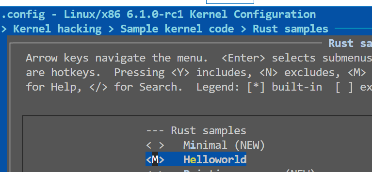
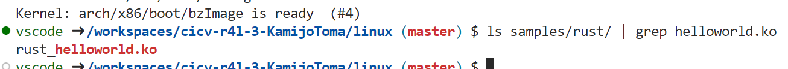
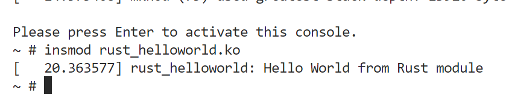

# 作业截图记录

## 作业1：编译busybox和linux kernel


## 作业2：编译e1000网卡的Rust驱动

正常按照文档步骤进行。其中遇到了一个问题：运行qemu后内核崩溃报错`VFS: Cannot open root device "ram" or unknown-block(1,0): error -6`

经过检查发现是脚本中的`cpio`命令没有安装。安装后解决问题。


### 问题回答：

1. 编译成内核模块，是在哪个文件中以哪条语句定义的？

***答：*** `Makefile` 中的 `$(MAKE) -C $(KDIR) M=$$PWD` 一行，指定make程序以linux内核目录中的makefile为基础构建本目录下的内核模块。

内核模块的定义在 `Kbuild` 文件中，指定了内核模块的二进制文件。

2. 该模块位于独立的文件夹内，却能编译成Linux内核模块，这叫做out-of-tree module，请分析它是如何与内核代码产生联系的？

***答：***

out-of-tree module的代码文件夹不在内核代码树内，却能够加载成为内核模块。

在构建阶段，通过问题1中的构建命令，make程序能够找到内核模块所依赖的内核代码树路径，并设置头文件搜索路径等编译器依赖信息，从而能够正常编译。

这类模块并不嵌入内核中，而是通过类似动态链接库的方式在需要时动态加载进入内核。为此，内核中实现了一套动态加载和卸载模块的机制，这类内核模块也需要编译为特殊的格式ko，即kernel object。
在运行阶段，内核根据需要动态加载模块到内核中。模块代码与内核代码动态交互。

## 作业3：使用rust编写一个简单的内核模块

主要涉及到对Kconfig和Makefile的修改。

修改Kconfig，加入下面的代码
```
config SAMPLE_RUST_HELLOWORLD
	tristate "Helloworld"
	help
	  This option is written by KamijoToma for cicv-r4l assignment 3
```
修改Makefile，加入下面一行
```makefile
obj-$(CONFIG_SAMPLE_RUST_HELLOWORLD)	+= rust_helloworld.o
```

运行`menuconfig`，能观察到出现了自定义的模块选项：


运行编译，成功编译了模块



进入QEMU系统，加载模块，成功输出了信息。

